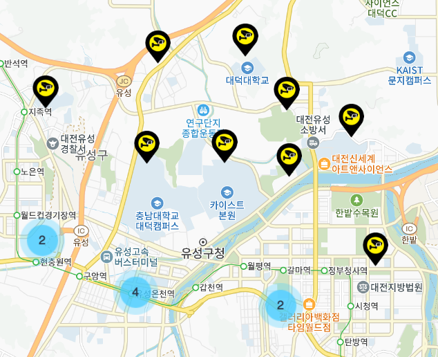
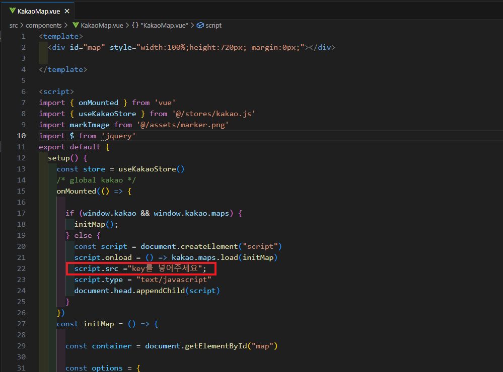

# clusterer

## Project setup
```
npm install
```

### Compiles and hot-reloads for development
```
npm run serve
```

## KakaoMap Clusterer Test 



## 지도 불러내기




""//dapi.kakao.com/v2/maps/sdk.js?appkey=나만의 키&libraries=clusterer"로 수정하시면 작동합니다
